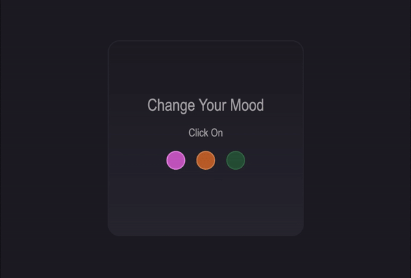

<h1 align="center"> Change your mood </h1>

## Descrição

Já ouviu falar que as cores mudam nosso humor? Trouxe aqui um estudo de mudança de cor no site, com o conceito de levar ao usuário a possibilidade de personalizar seu site de navegação conforme seu humor ou gosto.

<!-- 

 -->

## Status

Não Finalizado

## Objetivo

- `Desenvolver UI`
- `Praticar JavaScrit`

## Tecnologias utilizadas

- `HTML5`
- `CSS3`
- `JavaScript`

## Link de demonstração

> https://marianwiermann.github.io/PageColor/
